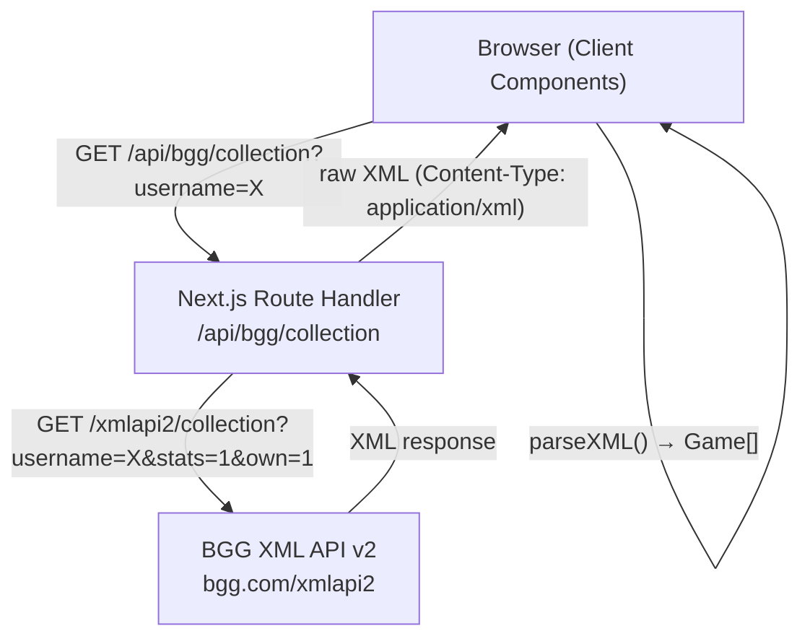

# Design Document: BGG Collection Browser

## Overview

The BGG Collection Browser is a single-page Next.js application that lets users look up any BoardGameGeek user's owned game collection, then interactively filter it by weight, playing time, and player count. The app proxies all BGG API calls through a Next.js Route Handler to avoid CORS, parses the XML response into typed `Game` objects on the client, and manages fetch state with TanStack Query v5. The UI is themed after BGG's visual identity using Shadcn components, Tailwind CSS v4, and a custom combined SVG logo.

The application is entirely client-driven after the initial page load: filtering is pure in-memory computation over the fetched collection, so no additional network requests are made when filters change.

### Key Design Decisions

- **XML parsing on the client**: The Route Handler returns raw XML; parsing happens in the browser. This keeps the Route Handler simple (no XML dependency on the server) and lets TanStack Query cache the parsed result.
- **Tailwind v4 + CSS custom properties for theming**: The project already uses Tailwind v4 (`@import "tailwindcss"` syntax). BGG colors are registered as CSS custom properties inside `@theme inline` and referenced via Tailwind utility classes. Shadcn components are configured to use these same variables.
- **TanStack Query for all async state**: Provides loading/error/success states, automatic retry, and stale-while-revalidate caching without manual `useEffect` wiring.
- **localStorage for username persistence**: Handled in a custom hook (`usePersistedUsername`) that reads on mount and writes on explicit user action.

---

## Architecture



### Data Flow

1. User enters a username and submits (or page loads with a saved username).
2. TanStack Query fires a fetch to `/api/bgg/collection?username={username}`.
3. The Route Handler forwards the request to BGG, retrying on HTTP 202 up to 3 times.
4. The raw XML is returned to the client.
5. The client parses the XML into `Game[]` using `DOMParser`.
6. TanStack Query caches the result; filter state is applied in-memory via `useMemo`.
7. The filtered `Game[]` is rendered as a grid of `GameCard` components.

---

## Components and Interfaces

### File Layout

```
app/
  api/
    bgg/
      collection/
        route.ts          # Route Handler — BGG API proxy
  page.tsx                # Root page (Server Component shell)
  layout.tsx              # Root layout (QueryClientProvider wrapper)
  globals.css             # Tailwind v4 + BGG CSS custom properties

components/
  collection-browser.tsx  # Main orchestrator (Client Component)
  game-card.tsx           # Individual game card
  filters/
    weight-filter.tsx     # Weight category checkboxes
    time-filter.tsx       # Playing time range slider
    player-count-filter.tsx # Recommended/Best player count selectors
  ui/                     # Shadcn generated components (button, checkbox, slider, etc.)
  bgg-logo.tsx            # Custom combined SVG logo

lib/
  parse-collection.ts     # XML → Game[] parser
  filter-games.ts         # Pure filter logic
  use-bgg-collection.ts   # TanStack Query hook
  use-persisted-username.ts # localStorage hook
  types.ts                # Shared TypeScript types

public/
  bgg-stats-logo.svg      # Self-contained combined SVG logo asset
```

### Component Hierarchy

```
RootLayout (Server)
└── QueryClientProvider (Client)
    └── Page (Server)
        └── CollectionBrowser (Client)
            ├── Header
            │   └── BggLogo
            ├── UsernameForm
            │   ├── Input (Shadcn)
            │   ├── Button "Load" (Shadcn)
            │   └── Button "Save" / "Clear" (Shadcn)
            ├── FilterPanel
            │   ├── WeightFilter
            │   ├── TimeFilter
            │   ├── PlayerCountFilter (recommended)
            │   └── PlayerCountFilter (best)
            ├── FilterSummaryBar (active filter count + Reset button)
            └── GameGrid
                ├── GameCard (×N)
                └── EmptyState / LoadingSkeleton / ErrorState
```

### Key Component Interfaces

```typescript
// CollectionBrowser — no props, owns all state
function CollectionBrowser(): JSX.Element

// GameCard
interface GameCardProps {
  game: Game;
}

// WeightFilter
interface WeightFilterProps {
  selected: WeightCategory[];
  onChange: (categories: WeightCategory[]) => void;
}

// TimeFilter
interface TimeFilterProps {
  min: number;
  max: number;          // dynamic bounds from collection
  value: [number, number];
  onChange: (range: [number, number]) => void;
}

// PlayerCountFilter (used for both recommended and best)
interface PlayerCountFilterProps {
  label: string;
  selected: number | "any";
  onChange: (value: number | "any") => void;
}
```

---

## Data Models

```typescript
// lib/types.ts

export type WeightCategory =
  | "Light"
  | "Medium Light"
  | "Medium"
  | "Medium Heavy"
  | "Heavy";

export interface Game {
  id: number;
  name: string;
  thumbnail: string | null;
  yearPublished: number | null;
  minPlayers: number;
  maxPlayers: number;
  minPlayingTime: number;
  maxPlayingTime: number;
  weight: number;           // 0 = unrated
  bggRank: number | null;
  userRating: number | null;
  recommendedPlayerCounts: number[];
  bestPlayerCounts: number[];
}

export interface FilterState {
  weightCategories: WeightCategory[];          // empty = all
  timeRange: [number, number];                 // [min, max] in minutes
  recommendedPlayerCount: number | "any";
  bestPlayerCount: number | "any";
}

export type CollectionResult =
  | { status: "success"; games: Game[] }
  | { status: "error"; message: string }
  | { status: "private" }
  | { status: "not-found" };
```

### Weight Category Derivation

```typescript
export function getWeightCategory(weight: number): WeightCategory | null {
  if (weight <= 0) return null;
  if (weight <= 1.0) return "Light";
  if (weight <= 2.0) return "Medium Light";
  if (weight <= 3.0) return "Medium";
  if (weight <= 4.0) return "Medium Heavy";
  return "Heavy";
}
```

### Serialization

`Game` objects are plain JSON-serializable objects (no `Date`, no `Map`, no class instances). This means TanStack Query can serialize them to its cache without any custom serializer, and they can be passed as props from Server to Client Components if needed.

---

## API Proxy Route Handler

**File**: `app/api/bgg/collection/route.ts`

```typescript
import { type NextRequest } from "next/server";

const BGG_BASE = "https://boardgamegeek.com/xmlapi2";
const MAX_RETRIES = 3;
const RETRY_DELAY_MS = 2000;

export async function GET(request: NextRequest) {
  const username = request.nextUrl.searchParams.get("username")?.trim();

  if (!username) {
    return new Response(JSON.stringify({ error: "username is required" }), {
      status: 400,
      headers: { "Content-Type": "application/json" },
    });
  }

  const url = `${BGG_BASE}/collection?username=${encodeURIComponent(username)}&stats=1&own=1`;

  for (let attempt = 0; attempt <= MAX_RETRIES; attempt++) {
    const res = await fetch(url, { cache: "no-store" });

    if (res.status === 202) {
      if (attempt < MAX_RETRIES) {
        await new Promise((r) => setTimeout(r, RETRY_DELAY_MS));
        continue;
      }
      return new Response(
        JSON.stringify({ error: "BGG is still processing the request. Please try again." }),
        { status: 503, headers: { "Content-Type": "application/json" } }
      );
    }

    if (!res.ok) {
      return new Response(
        JSON.stringify({ error: `BGG API returned ${res.status}` }),
        { status: res.status, headers: { "Content-Type": "application/json" } }
      );
    }

    const xml = await res.text();
    return new Response(xml, {
      status: 200,
      headers: { "Content-Type": "application/xml" },
    });
  }
}
```

**Design notes**:
- `cache: "no-store"` on the upstream `fetch` ensures BGG always returns fresh data.
- The handler returns raw XML; parsing is the client's responsibility.
- HTTP 202 retry loop is bounded to avoid infinite waiting.

---

## XML Parsing Logic

**File**: `lib/parse-collection.ts`

The parser uses the browser's built-in `DOMParser` (no third-party XML library needed). This keeps the bundle small and avoids server-side XML dependencies.

### Parsing Strategy

```
XML string
  → DOMParser.parseFromString(xml, "text/xml")
  → check for <message> root element → CollectionResult { status: "error" | "not-found" | "private" }
  → querySelectorAll("item[subtype='boardgame']")
  → for each item:
      id          ← item.getAttribute("objectid")
      name        ← item.querySelector("name")?.textContent
      thumbnail   ← item.querySelector("thumbnail")?.textContent
      yearPublished ← item.querySelector("yearpublished")?.textContent
      minPlayers  ← item.querySelector("stats")?.getAttribute("minplayers")
      maxPlayers  ← item.querySelector("stats")?.getAttribute("maxplayers")
      minPlayingTime ← item.querySelector("stats")?.getAttribute("minplaytime")
      maxPlayingTime ← item.querySelector("stats")?.getAttribute("maxplaytime")
      weight      ← item.querySelector("averageweight")?.getAttribute("value")
      bggRank     ← item.querySelector("rank[name='boardgame']")?.getAttribute("value")
      userRating  ← item.querySelector("stats rating")?.getAttribute("value")  ("N/A" → null)
      recommendedPlayerCounts ← poll[name="suggested_numplayers"] results where result[@value="Recommended"] is highest vote
      bestPlayerCounts        ← same poll, result[@value="Best"] is highest vote
  → Game[]
```

### Player Count Poll Parsing

The `<poll name="suggested_numplayers">` element contains `<results numplayers="N">` children, each with `<result value="Best|Recommended|Not Recommended" numvotes="N"/>`. A player count is considered "Best" or "Recommended" when that option has the most votes among the three options for that player count.

```typescript
function parsePlayerCountPoll(item: Element, voteValue: "Best" | "Recommended"): number[] {
  const poll = item.querySelector('poll[name="suggested_numplayers"]');
  if (!poll) return [];
  const counts: number[] = [];
  for (const results of poll.querySelectorAll("results")) {
    const numPlayers = parseInt(results.getAttribute("numplayers") ?? "", 10);
    if (isNaN(numPlayers)) continue;
    const votes = Object.fromEntries(
      Array.from(results.querySelectorAll("result")).map((r) => [
        r.getAttribute("value"),
        parseInt(r.getAttribute("numvotes") ?? "0", 10),
      ])
    );
    const maxVotes = Math.max(...Object.values(votes));
    if (maxVotes > 0 && votes[voteValue] === maxVotes) {
      counts.push(numPlayers);
    }
  }
  return counts;
}
```

### Round-Trip Serialization

`Game` objects are plain JSON-serializable. The round-trip property (Requirement 3.9) is satisfied by:
1. Parse XML → `Game[]`
2. `JSON.stringify(games)` → string
3. `JSON.parse(string)` → `Game[]`

The two arrays must be deeply equal. This is testable as a property.

---

## Filter Logic

**File**: `lib/filter-games.ts`

All filtering is a pure function with no side effects:

```typescript
export function filterGames(games: Game[], filters: FilterState): Game[] {
  return games.filter((game) => {
    // Weight filter
    if (filters.weightCategories.length > 0) {
      const cat = getWeightCategory(game.weight);
      if (!cat || !filters.weightCategories.includes(cat)) return false;
    }

    // Time filter (only applied when not at default full range)
    const isDefaultRange =
      filters.timeRange[0] === collectionMinTime(games) &&
      filters.timeRange[1] === collectionMaxTime(games);
    if (!isDefaultRange) {
      if (game.minPlayingTime === 0 && game.maxPlayingTime === 0) return false;
      if (game.maxPlayingTime < filters.timeRange[0]) return false;
      if (game.minPlayingTime > filters.timeRange[1]) return false;
    }

    // Recommended player count filter
    if (filters.recommendedPlayerCount !== "any") {
      if (!game.recommendedPlayerCounts.includes(filters.recommendedPlayerCount)) return false;
    }

    // Best player count filter
    if (filters.bestPlayerCount !== "any") {
      if (!game.bestPlayerCounts.includes(filters.bestPlayerCount)) return false;
    }

    return true;
  });
}
```

The `CollectionBrowser` component derives filtered games via `useMemo`:

```typescript
const filteredGames = useMemo(
  () => filterGames(games, filterState),
  [games, filterState]
);
```

---

## TanStack Query Usage

**File**: `lib/use-bgg-collection.ts`

```typescript
import { useQuery } from "@tanstack/react-query";
import { parseCollection } from "./parse-collection";
import type { CollectionResult } from "./types";

async function fetchCollection(username: string): Promise<CollectionResult> {
  const res = await fetch(`/api/bgg/collection?username=${encodeURIComponent(username)}`);
  if (!res.ok) {
    const { error } = await res.json();
    return { status: "error", message: error };
  }
  const xml = await res.text();
  return parseCollection(xml);
}

export function useBggCollection(username: string | null) {
  return useQuery({
    queryKey: ["bgg-collection", username],
    queryFn: () => fetchCollection(username!),
    enabled: !!username,
    staleTime: 5 * 60 * 1000,   // 5 minutes — collections don't change often
    retry: 2,
    retryDelay: (attempt) => attempt * 1000,
  });
}
```

**Query key design**: `["bgg-collection", username]` — changing the username automatically triggers a new fetch and caches results per username.

**Stale time**: 5 minutes. BGG collections are not real-time; this avoids redundant fetches when the user navigates away and back.

**Retry**: TanStack Query retries 2 times on network errors (distinct from the 202-retry handled in the Route Handler).

**QueryClientProvider**: Wrapped in a Client Component in `app/layout.tsx`:

```typescript
// app/providers.tsx  ('use client')
import { QueryClient, QueryClientProvider } from "@tanstack/react-query";
import { useState } from "react";

export function Providers({ children }: { children: React.ReactNode }) {
  const [queryClient] = useState(() => new QueryClient());
  return <QueryClientProvider client={queryClient}>{children}</QueryClientProvider>;
}
```

---

## localStorage Persistence

**File**: `lib/use-persisted-username.ts`

```typescript
'use client';
import { useState, useEffect } from "react";

const STORAGE_KEY = "bgg-stats:username";

export function usePersistedUsername() {
  const [savedUsername, setSavedUsername] = useState<string | null>(null);

  useEffect(() => {
    setSavedUsername(localStorage.getItem(STORAGE_KEY));
  }, []);

  const save = (username: string) => {
    if (!username.trim()) return false;
    localStorage.setItem(STORAGE_KEY, username.trim());
    setSavedUsername(username.trim());
    return true;
  };

  const clear = () => {
    localStorage.removeItem(STORAGE_KEY);
    setSavedUsername(null);
  };

  return { savedUsername, save, clear };
}
```

**Design notes**:
- `useEffect` defers the `localStorage` read to after hydration, avoiding SSR/client mismatch.
- `save` returns `false` for empty/whitespace input so the caller can show a validation message.
- The `CollectionBrowser` reads `savedUsername` on mount and, if non-null, sets it as the initial query username to trigger an automatic fetch (Requirement 12.4).

---

## Custom SVG Logo

**File**: `public/bgg-stats-logo.svg`

The logo extends the original BGG SVG (`80×38px`, white "BGG" paths + orange `#FF5100` polygon) by appending SVG path data for the word "Stats" to the right. The combined asset is self-contained (no external font references) — the "Stats" text is rendered as SVG `<path>` elements traced from the same visual style as the "BGG" letterforms.

**Dimensions**: `width="140" height="38"` (original 80px + ~60px for "Stats").

**Structure**:
```xml
<svg xmlns="http://www.w3.org/2000/svg" width="140" height="38" viewBox="0 0 140 38">
  <!-- Original BGG orange polygon logo mark -->
  <polygon fill="#FF5100" points="..." />
  <!-- Original BGG white "BGG" text paths -->
  <path fill="#ffffff" d="..." />
  <!-- New "Stats" text paths, same fill, same baseline -->
  <path fill="#ffffff" d="..." />
</svg>
```

**Component**: `components/bgg-logo.tsx` renders the SVG inline (not as an ``) so the fill colors respond to CSS theme variables if needed.

---

## Shadcn Theme Configuration

Shadcn uses CSS custom properties for all colors. The BGG theme is applied by overriding these variables in `app/globals.css` using Tailwind v4's `@theme inline` block:

```css
/* app/globals.css */
@import "tailwindcss";

@theme inline {
  --color-background: var(--background);
  --color-foreground: var(--foreground);
  --color-bgg-orange: #FF5100;
  --color-bgg-navy: #1a1a2e;
  --font-sans: var(--font-geist-sans);
  --font-mono: var(--font-geist-mono);
}

/* Light mode */
:root {
  --background: #f5f5f5;
  --foreground: #1a1a2e;
  --card: #ffffff;
  --card-foreground: #1a1a2e;
  --primary: #FF5100;
  --primary-foreground: #ffffff;
  --muted: #e5e5e5;
  --muted-foreground: #6b7280;
  --border: #d1d5db;
  --ring: #FF5100;
}

/* Dark mode */
.dark, @media (prefers-color-scheme: dark) {
  :root {
    --background: #1a1a2e;
    --foreground: #f0f0f0;
    --card: #16213e;
    --card-foreground: #f0f0f0;
    --primary: #FF5100;
    --primary-foreground: #ffffff;
    --muted: #0f3460;
    --muted-foreground: #9ca3af;
    --border: #374151;
    --ring: #FF5100;
  }
}
```

Shadcn components reference `--primary`, `--card`, `--border`, etc. via their generated CSS, so they automatically adopt the BGG palette without any component-level overrides.

---

## Error Handling

| Scenario | Route Handler Response | Client Behavior |
|---|---|---|
| Empty username | 400 JSON `{ error }` | Inline validation, no fetch |
| BGG 202 (queued), retries exhausted | 503 JSON `{ error }` | Error state with retry button |
| BGG non-200 status | Same status, JSON `{ error }` | Error state with retry button |
| Network failure | fetch throws | TanStack Query retries 2×, then error state |
| XML `<message>` element | Parsed as `CollectionResult` | "User not found" or "Collection is private" message |
| Missing optional fields | `null` values in `Game` | UI renders fallbacks (placeholder image, "N/A") |

The `CollectionBrowser` maps `CollectionResult` status to UI states:
- `"success"` → game grid
- `"error"` → error message + retry button
- `"not-found"` → "User not found" message
- `"private"` → "This collection is private" message

---

## Testing Strategy

See `TESTING_GUIDELINES.md` for the full testing approach. This project follows the **Testing Trophy** strategy: mostly integration tests, some unit tests, property-based tests for pure logic, and static analysis always on.

### Testing Libraries

- **Vitest** — test runner
- **@testing-library/react** + **@testing-library/user-event** — component and integration tests
- **@testing-library/jest-dom** — DOM matchers
- **fast-check** — property-based tests for pure functions
- **MSW (Mock Service Worker)** — HTTP mocking at the network boundary

### Test Description Format

All test descriptions use **Gherkin notation**: `Given ... When ... Then ...`

```typescript
it("Given a saved username in localStorage, When the page loads, Then the collection is fetched automatically", ...);
it("Given the weight filter has no categories selected, When the user selects 'Medium', Then only Medium-weight games are shown", ...);
```

### Integration Tests (majority)

Test components and pages through the DOM as a user would interact with them. HTTP requests are mocked via MSW.

Focus areas:
- `CollectionBrowser`: username submission, loading skeleton, error states, retry button, filter interactions, reset filters, game count display
- `GameCard`: all display fields rendered correctly, BGG link, "Not rated" fallback, "N/A" rank fallback
- `UsernameForm`: empty submission shows validation, save/clear localStorage controls
- `WeightFilter`, `TimeFilter`, `PlayerCountFilter`: user interactions update the game list

### Unit Tests (some)

For pure functions with no DOM involvement:

- `parseCollection`: XML fixtures (normal game, missing fields, `<message>` element, private collection)
- `filterGames`: specific filter combinations
- `getWeightCategory`: boundary values (0, 1.0, 2.0, 3.0, 4.0, 5.0)
- `usePersistedUsername`: save/clear with mocked `localStorage`

### Property-Based Tests (fast-check)

Co-located in unit test files under a `describe("properties", ...)` block. Each test includes a comment referencing the design property it validates:

```typescript
// Feature: bgg-collection-browser, Property 3: Weight Filter Correctness
it("Given any selection of weight categories, When filterGames is called, Then every returned game matches one of the selected categories", () => {
  fc.assert(fc.property(...));
});
```


---

## Correctness Properties

*A property is a characteristic or behavior that should hold true across all valid executions of a system — essentially, a formal statement about what the system should do. Properties serve as the bridge between human-readable specifications and machine-verifiable correctness guarantees.*

### Property 1: XML Parsing Round-Trip

*For any* array of `Game` objects, serializing them to JSON and then deserializing back should produce an array that is deeply equal to the original.

This validates that `Game` is a plain JSON-serializable type with no information loss across the serialize/deserialize boundary, which is the foundation of the explicit round-trip requirement.

**Validates: Requirements 3.9**

---

### Property 2: Missing Optional Fields Produce Null, Not Errors

*For any* BGG collection XML where optional fields (`thumbnail`, `yearPublished`, `bggRank`, `userRating`) are absent from one or more game entries, parsing should succeed and those fields should be `null` rather than throwing an exception.

**Validates: Requirements 3.4, 3.2, 3.7**

---

### Property 3: Weight Filter Correctness

*For any* non-empty selection of `WeightCategory` values and any array of `Game` objects, every game returned by `filterGames` should have a `weight` that maps to one of the selected categories, and games with `weight <= 0` should be excluded.

**Validates: Requirements 5.2, 5.3**

---

### Property 4: Playing Time Filter Overlap Correctness

*For any* `[sliderMin, sliderMax]` range that is not the full collection range, and any array of `Game` objects, every game returned by `filterGames` should satisfy `maxPlayingTime >= sliderMin AND minPlayingTime <= sliderMax`, and games where both `minPlayingTime` and `maxPlayingTime` are 0 should be excluded.

**Validates: Requirements 6.5, 6.7**

---

### Property 5: Recommended Player Count Filter Correctness

*For any* player count `N` (1–10) and any array of `Game` objects, every game returned by `filterGames` with `recommendedPlayerCount = N` should have `N` in its `recommendedPlayerCounts` array.

**Validates: Requirements 7.2**

---

### Property 6: Best Player Count Filter Correctness

*For any* player count `N` (1–10) and any array of `Game` objects, every game returned by `filterGames` with `bestPlayerCount = N` should have `N` in its `bestPlayerCounts` array.

**Validates: Requirements 8.2**

---

### Property 7: AND Filter Composition

*For any* `FilterState` with multiple active filters and any array of `Game` objects, every game returned by `filterGames` must individually satisfy every active filter — i.e., the result is the intersection of all individual filter results.

Formally: `filterGames(games, combinedFilters)` ⊆ `filterGames(games, filterA)` ∩ `filterGames(games, filterB)` for any two active sub-filters A and B.

**Validates: Requirements 9.1**

---

### Property 8: Reset Filters Round-Trip

*For any* array of `Game` objects and any `FilterState`, applying `filterGames` with the default (all-unset) `FilterState` should return all games unchanged.

Formally: `filterGames(games, defaultFilterState).length === games.length` and the result contains the same games.

**Validates: Requirements 9.2**

---

### Property 9: Active Filter Count Accuracy

*For any* `FilterState`, the count of "active" (non-default) filters should equal the number of filter dimensions that differ from their default values.

Formally: a weight filter with 2 categories selected counts as 1 active filter; a time range not at full bounds counts as 1; a non-"any" player count counts as 1 each.

**Validates: Requirements 9.4**

---

### Property 10: Displayed Game Count Equals Filtered Length

*For any* `FilterState` and any collection of `Game` objects, the count displayed in the UI should equal `filterGames(games, filterState).length`.

**Validates: Requirements 4.3**

---

### Property 11: GameCard Renders All Required Display Fields

*For any* `Game` object, the rendered `GameCard` output should contain: the game name, a link to `https://boardgamegeek.com/boardgame/{id}`, the weight formatted as `"{value} – {category}"`, the playing time formatted as `"{min}–{max} min"` (or `"{N} min"` when equal), and the user rating formatted as `"{value}/10"` or `"Not rated"`.

**Validates: Requirements 4.1, 4.6**

---

### Property 12: Time Range Bounds Derived from Collection

*For any* non-empty array of `Game` objects, the derived slider lower bound should equal `Math.min(...games.map(g => g.minPlayingTime))` and the upper bound should equal `Math.max(...games.map(g => g.maxPlayingTime))`.

**Validates: Requirements 6.2**

---

### Property 13: Time Range Label Format

*For any* `[min, max]` pair of non-negative integers, the time range label should be the string `"{min}–{max} min"`.

**Validates: Requirements 6.4**

---

### Property 14: API Proxy XML Passthrough

*For any* valid XML string returned by the BGG API with status 200, the Route Handler should return that exact XML string with `Content-Type: application/xml`.

**Validates: Requirements 2.2, 2.6**

---

### Property 15: API Proxy Error Status Passthrough

*For any* non-200, non-202 HTTP status code returned by the BGG API, the Route Handler should return a response with that same status code.

**Validates: Requirements 2.4**

---

### Property 16: localStorage Save and Reject

*For any* non-empty, non-whitespace username string, calling `save(username)` should result in `localStorage.getItem(STORAGE_KEY)` returning that username. *For any* string composed entirely of whitespace, calling `save(username)` should not write to `localStorage` and should return `false`.

**Validates: Requirements 12.2, 12.3**

---

### Property 17: localStorage Clear Round-Trip

*For any* username that has been saved to `localStorage`, calling `clear()` should result in `localStorage.getItem(STORAGE_KEY)` returning `null`.

**Validates: Requirements 12.6**

---

### Property 18: Whitespace Username Rejected at Submission

*For any* string composed entirely of whitespace characters, submitting it as a username should not trigger a fetch to `/api/bgg/collection` and should display a validation message.

**Validates: Requirements 1.3, 12.3**
